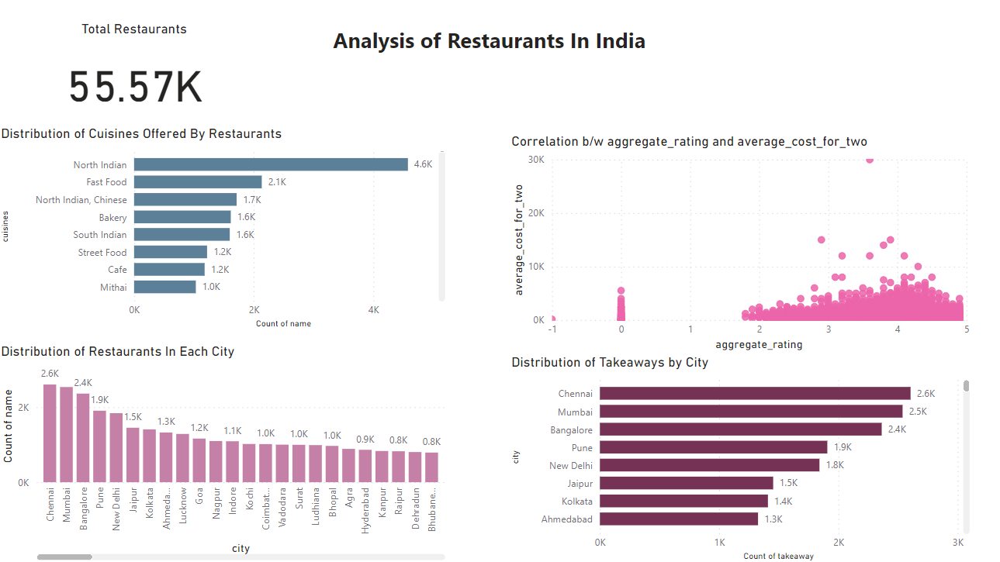
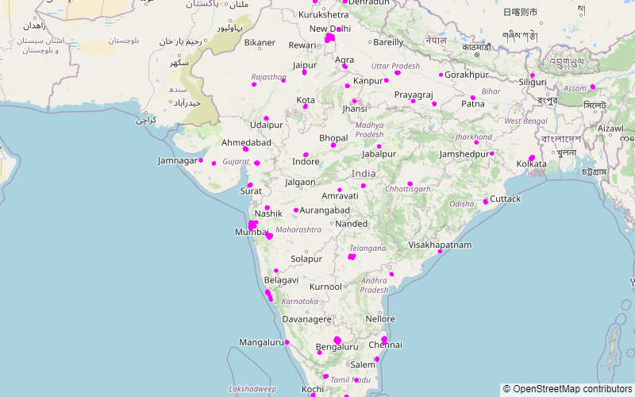

# Indian Restaurants Analysis and Marketing Campaign

This project analyzes restaurant data from various regions in India and proposes a marketing campaign based on the insights derived from the analysis. The analysis includes descriptive statistics, distribution analysis, correlation analysis, regional analysis, customer preference analysis, competitive analysis, and market gap analysis.

## Table of Contents

- [Introduction](#introduction)
- [Key Findings](#key-findings)
- [Analysis Details](#analysis-details)
- [Marketing Campaign Proposal](#marketing-campaign-proposal)
- [Visualizations](#visualizations)
- [Conclusion](#conclusion)

## Introduction

The restaurant industry in India is diverse and dynamic, with a wide range of cuisines, price ranges, and dining preferences across different regions. Understanding the market landscape and customer preferences is crucial for restaurant chains to develop effective marketing strategies and stay competitive.

This project aims to provide insights into the Indian restaurant industry through data analysis and propose a marketing campaign tailored to capitalize on market opportunities and customer preferences.

## Key Findings

- Descriptive statistics reveal the average cost for two, price range, aggregate rating, and votes for restaurants.
  

- Distribution analysis highlights variations in price range, rating, and  most popular cuisine.

- Correlation analysis shows the relationship between aggregate rating, price range, and votes.
  

- Regional analysis identifies unique characteristics of dining scenes and popular cuisines in each region.
- Customer preference analysis examines the types of cuisines preferred in different regions and their relationship with restaurant ratings and pricing.

- **Competitive analysis:** Identifing major competitors, their strengths, and weaknesses.
  
  

  
  
- **Market gap analysis:** Identifing opportunities for restaurant chains to fill gaps in the market.

 In India")

## Analysis Details

The analysis is conducted using Python programming language and various libraries such as Pandas, NumPy, Matplotlib, and Seaborn. The dataset used for analysis contains information about restaurants, including their location, average cost, price range, aggregate rating, votes, and more.

## Marketing Campaign Proposal

Based on the insights gathered from the analysis, the marketing campaign proposal includes strategies for targeting different regions, segment-specific targeting, differentiation from competitors, and promotional tactics. The goal is to attract and retain customers by offering personalized experiences, highlighting unique selling propositions, and leveraging promotional offers.

## Visualizations

The project includes various visualizations such as histograms, scatter plots, and heatmaps to illustrate distribution, correlations, regional trends and dashboards. These visualizations help stakeholders understand the data and derive meaningful insights.

## Conclusion

The project provides valuable insights into the Indian restaurant industry and proposes a comprehensive marketing campaign to help restaurant chains navigate the competitive landscape, capitalize on market opportunities, and meet customer expectations. By leveraging data-driven strategies, restaurant chains can enhance their market position and drive business growth.

For more details and access to the code, please refer to the Jupyter Notebook and PowerBI file included in this repository.
